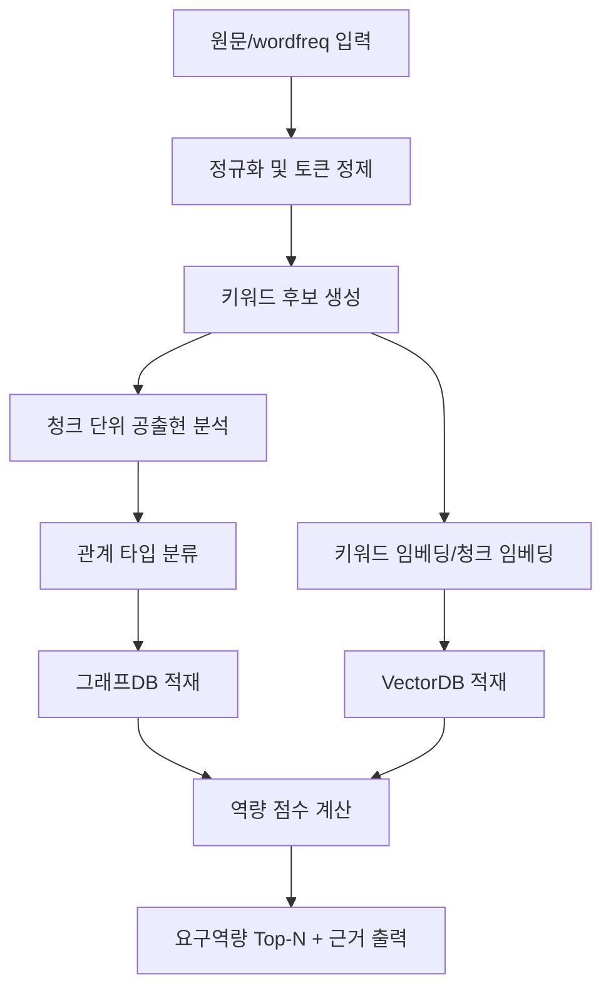
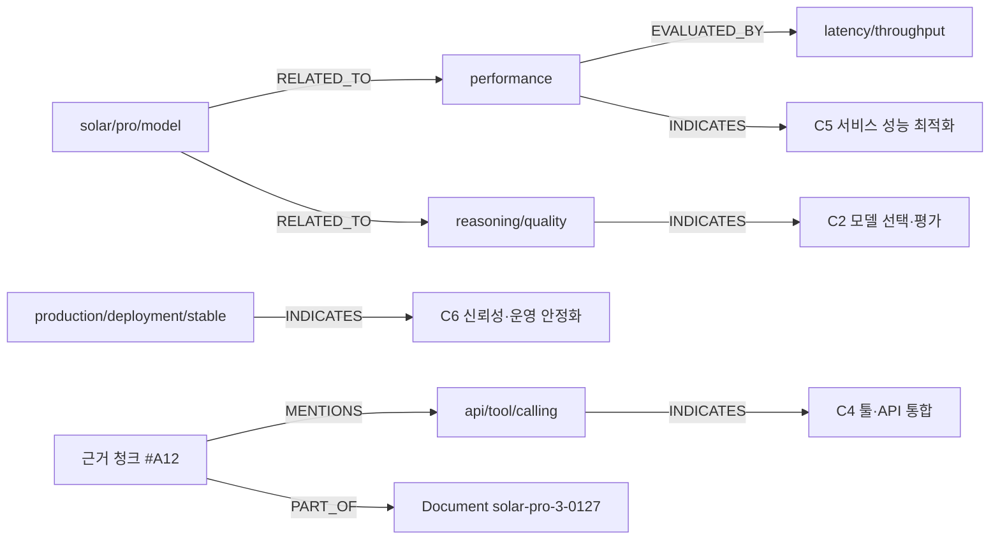

# 설계서: AI Agent Product Engineer 요구역량 추론 시스템

## 1. 설계 목표
- 입력 키워드/원문 청크로부터 직무 요구역량을 설명 가능하게 추론한다.
- 그래프DB(관계성)와 VectorDB(문맥 검색)를 결합한 하이브리드 구조를 채택한다.

## 2. 시스템 구성
- 입력 계층: 원문, 키워드 빈도, 문서 메타정보
- 정제 계층: 정규화, 동의어 통합, 노이즈 제거
- 분석 계층: 관계 그래프 생성, 역량 점수 산출
- 저장 계층: Graph Store + Vector Store
- 출력 계층: 역량 Top-N, 근거 키워드, 근거 청크, 관계 시각화

## 3. 데이터 모델

### 3.1 노드
- `Keyword`: 정규화된 키워드
- `Competency`: 직무 역량 코드(C1~C10)
- `Chunk`: 원문 청크
- `Document`: 문서 메타정보

### 3.2 엣지
- `Keyword -> Keyword`: `RELATED_TO`, `IMPROVES`, `TRADE_OFF` 등
- `Keyword -> Competency`: `USED_IN`, `INDICATES`
- `Chunk -> Keyword`: `MENTIONS`
- `Chunk -> Document`: `PART_OF`
- 각 엣지 필수 속성: `weight`, `confidence`, `evidence_chunk_id`, `doc_id`

## 4. 처리 흐름

## 5. 관계 그래프 시각화 (예시)

## 6. 역량 점수 산식 (권장)
- 기본: `score(c) = Σ keyword_weight(k,c)`
- 보정 1: 상위 빈도 키워드 가중치 `x1.5`
- 보정 2: 동일 청크 동시출현 보너스 `+2`
- 보정 3: 명시적 관계 타입(`IMPROVES/REQUIRES`) 근거 시 `+1`
- 출력: 점수 상위 역량 + 신뢰도(`high/medium/low`)

## 7. 저장 스키마 제안

### 7.1 VectorDB 메타필드
- `doc_id`, `chunk_id`, `source`, `timestamp`, `language`, `keywords[]`, `competency_candidates[]`

### 7.2 GraphDB 속성
- 노드: `id`, `type`, `label`, `norm`, `freq`
- 엣지: `relation_type`, `weight`, `confidence`, `doc_id`, `chunk_id`, `created_at`

## 8. 품질 관리
- 규칙 기반 검증: 금지 토큰, 숫자 단독 토큰, 오탈자 토큰 비율
- 샘플 수동 검증: 역량 Top-3와 근거 청크 일치 여부
- 재현성 검증: 동일 입력 재실행 시 결과 안정성

## 9. 알려진 한계
- 빈도 중심 입력만으로는 인과관계 단정 불가
- 시계열/다중문서 통합 시 드리프트 가능
- 한영 혼합에서 동의어 사전 품질이 결과를 크게 좌우

## 10. 구현 우선순위
- P1: 정규화 + 매핑 사전 + 그래프 기본 구축
- P2: 근거 청크 연결 + 관계 타입 정교화
- P3: VectorDB 하이브리드 검색 + 설명 리포트 자동화
